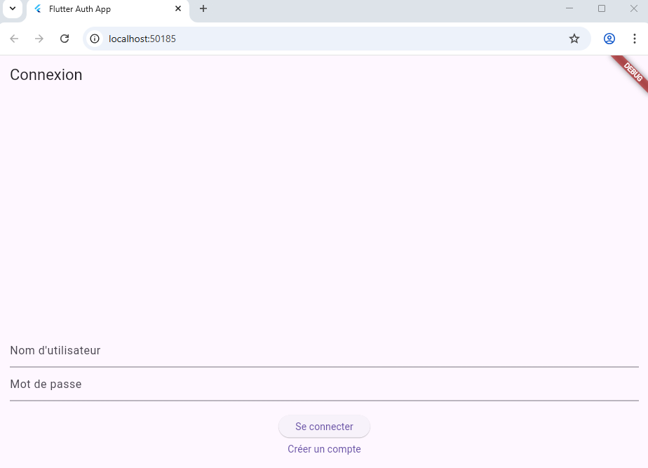
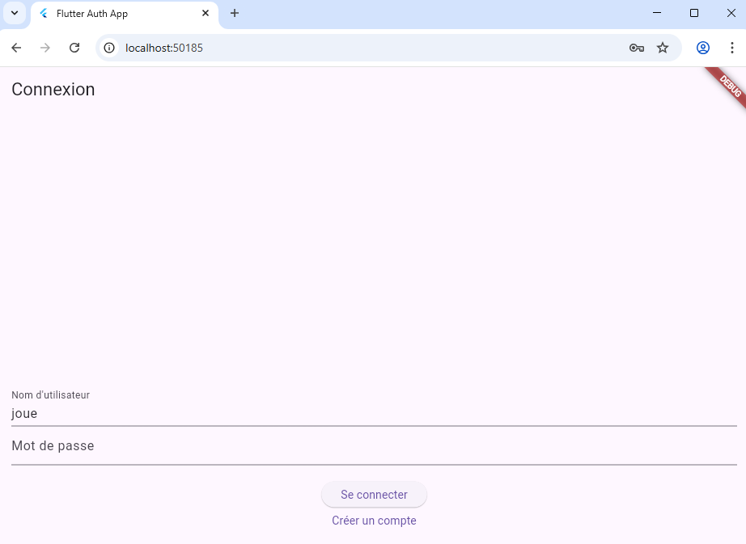
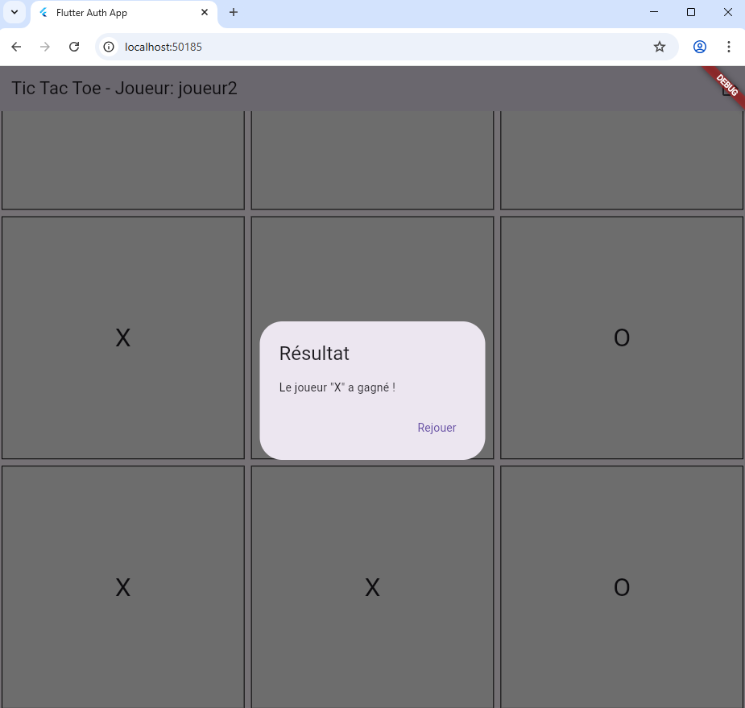

# flutter_nav_app

Le Jeu de Morpion est un jeu de société qui permet de créer un joueur et de jouer contre l'ordinateur.

L'application enregistre un nouveau utilisateur, l'authentifie puis joue au jeu.

## Captures d'écran (version web)

<p align="center">
  <em>Ecran d'authentification en version web</em><br/>
  
</p>

<p align="center">
  <em>Ecran d'inscription en version web</em><br/>
  
</p>

<p align="center">
  <em>Jeu de Morpin en version web</em><br/>
  
</p>

## Getting Started

1. Clonez le projet

```bash
   git clone https://github.com/elghariaoui/flutter_nav_app.git
   ```

2. Installer les dépendances

```bash
   flutter pub get
   ```

3. Lancer l'application

```bash
   flutter run
   ```

